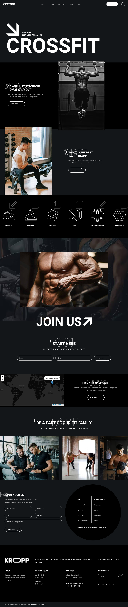

# Kropp Fitness

**Kropp Fitness** — это веб-сайт фитнес-клуба, предоставляющий пользователям информацию о тренировках, расписании, событиях и возможностях присоединиться к клубу. Сайт разработан с использованием современных технологий для обеспечения адаптивности и удобного пользовательского интерфейса.

## Описание проекта

Kropp Fitness предлагает:

- **Информацию о тренировках**: подробности о типах тренировок и расписании занятий.
- **События**: анонсы предстоящих мероприятий, таких как соревнования по кроссфиту и специальные тренировки.
- **Форма подписки**: возможность записаться на занятия или мероприятия клуба.
- **Интерактивная карта**: чтобы пользователи могли легко найти расположение клуба.

## Используемые технологии

- **HTML5** — семантически правильная разметка.
- **CSS3** — кастомные стили и медиа-запросы для адаптивного дизайна.
- **JavaScript** — для интерактивных элементов и анимаций.
- **Leaflet** — библиотека для отображения карт.
- **Методология БЭМ** — для структурирования кода и облегчения поддержки стилей.

## Скриншот

  

